# Étapes DVC

## Étape 1 : Initialisation de DVC dans le projet
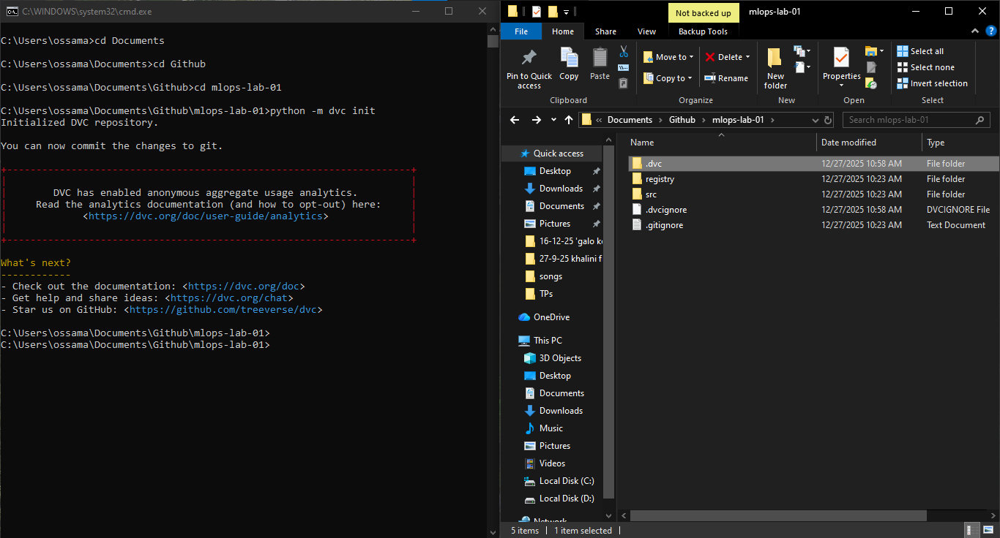

## Étape 2 : Versionner les données brutes avec DVC
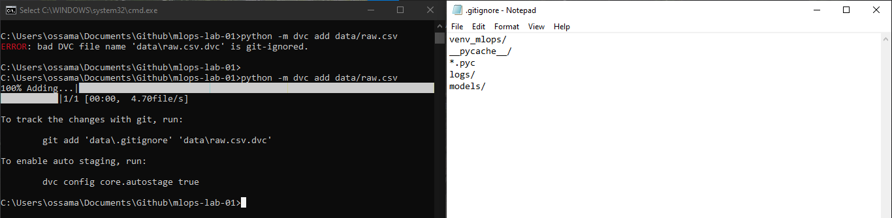
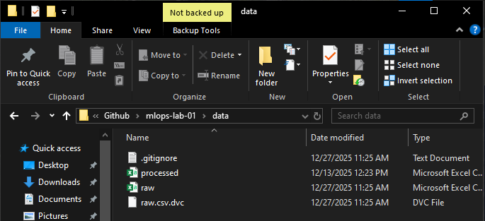
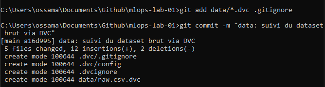

## Étape 3 : Configuration d’un remote DVC
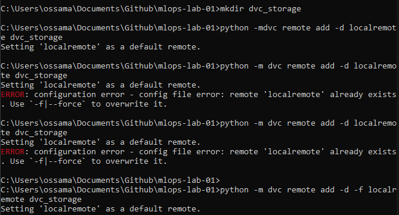
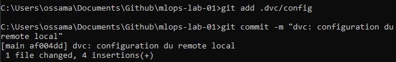

## Étape 4 : Push des données dans le remote DVC
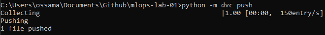

## Étape 5 : Simulation d’une collaboration : supprimer localement et récupérer depuis DVC
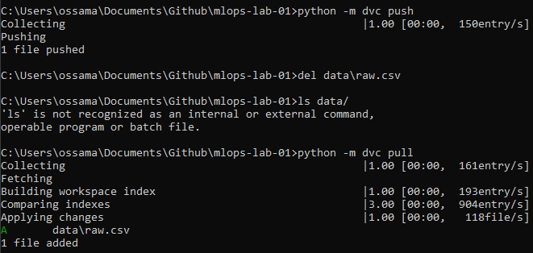

## Étape 6 : Création d’un pipeline reproductible dvc.yaml
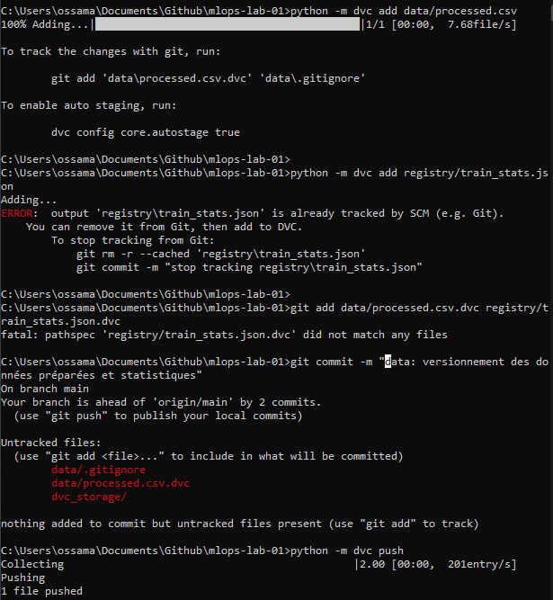
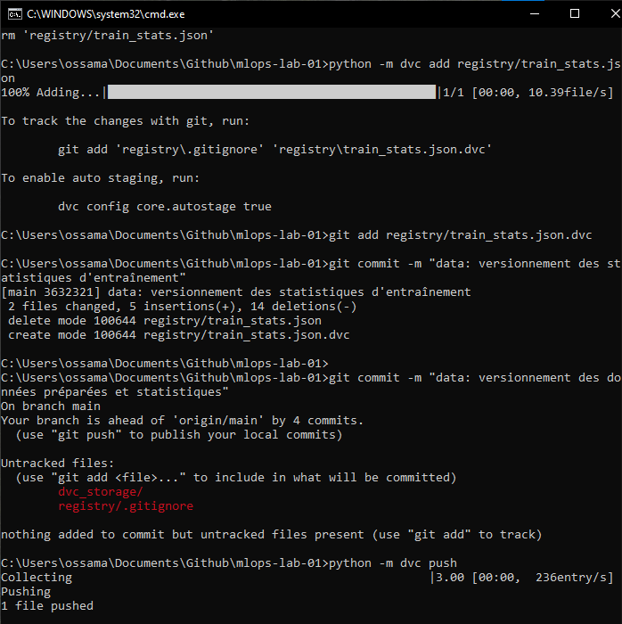

## Étape 7 : Reproduire automatiquement tout le pipeline
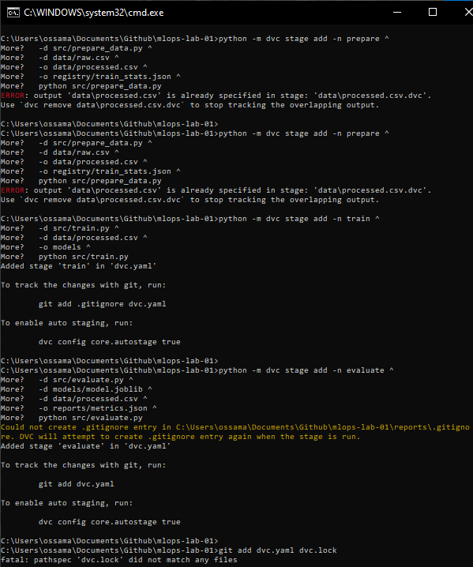
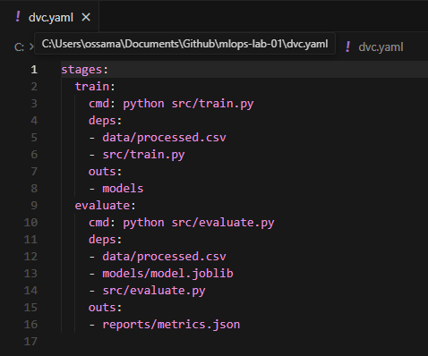

## Étape 8 : Autres captures
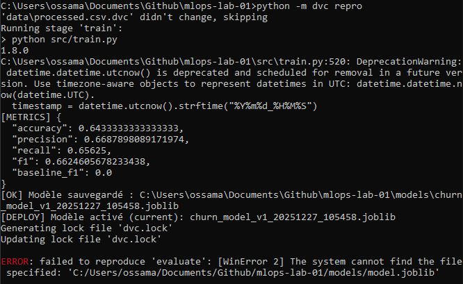
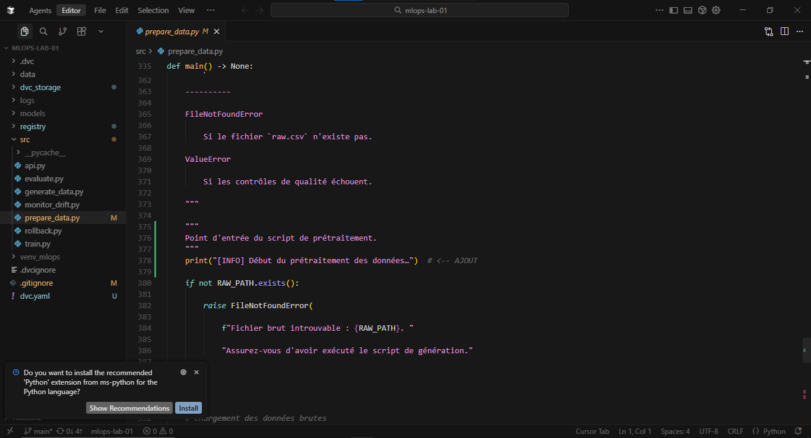
